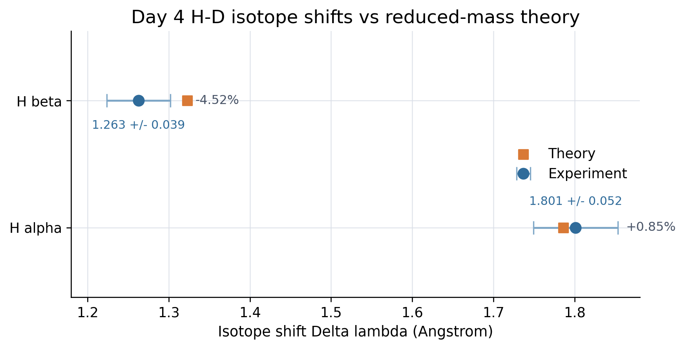
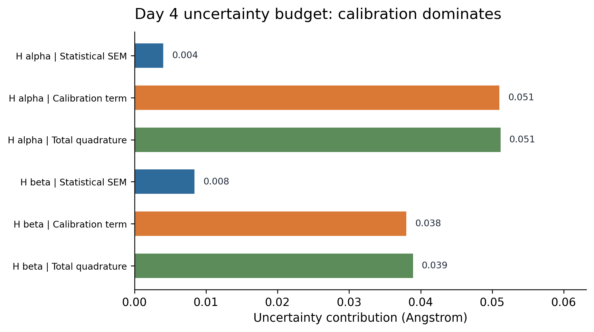

# H-D isotope shift in the Balmer series

This repository documents a hydrogen-deuterium isotope-shift measurement carried out with a scanning monochromator and photomultiplier readout. The focus here is the analysis workflow: repeated measurements, calibration-aware uncertainty propagation, and comparison with reduced-mass theory.

## What This Demonstrates

This repository shows careful treatment of repeated measurements, calibration terms,
and sensitivity to window choices in raw-scan fitting. I keep both the table
recomputation script and the optional raw-fit script visible so the repository
distinguishes stable reported results from more assumption-sensitive exploratory fits.

## At a Glance

- **Data workflow:** repeated H-D scans and calibration records are reduced into
  comparison tables, uncertainty budgets, JSON summaries, and diagnostic figures.
- **Methods signal:** repeated-measurement aggregation, calibration-aware uncertainty
  propagation, and sensitivity checks for raw fitting windows.
- **Reproducibility signal:** the main script recomputes the stable Day 4 results,
  while the raw-fit helper keeps more assumption-sensitive choices separate and visible.
- **Transferable skill:** the project shows how I separate validated results from
  exploratory analyses, a useful habit for AI-assisted research and human validation.

Authors: Hongyu Wang, Cici Zhang  
Advisor: Philip Lubin, Department of Physics, UC Santa Barbara

## Day 4 summary

The final results come from the Day 4 new-lamp dataset, where four repeated scans were recorded for each Balmer line and combined with the quoted scan-rate calibration term.

| Line | Experimental Delta lambda (A) | Total uncertainty (A) | Theory (A) | Percent difference |
| --- | ---: | ---: | ---: | ---: |
| H alpha | 1.801 | 0.052 | 1.7858 | +0.85% |
| H beta | 1.263 | 0.039 | 1.3228 | -4.52% |

`H alpha` is close to the theoretical value within the quoted total uncertainty. `H beta` shows the larger deviation and is the more calibration-sensitive result in this dataset.

## Analysis figures

**Experimental shifts compared with theory**



**Statistical vs calibration uncertainty**



## Python analysis workflow

- Recompute the reported Day 4 values from the recorded trial shifts
- Separate statistical scatter from the scan-rate calibration term
- Propagate total uncertainty in quadrature
- Export machine-readable outputs to CSV and JSON
- Optionally refit raw H-D doublets with a two-Gaussian plus linear-baseline model

The main reproducible script is [analysis/recompute_tables_day4.py](analysis/recompute_tables_day4.py). It regenerates the comparison table, the uncertainty-budget table, and the two summary figures shown above.

The raw-scan fitting helper [analysis/fit_from_raw.py](analysis/fit_from_raw.py) is intentionally kept separate, because overlapping peaks and baseline drift make automated fits sensitive to the chosen time window. The repository includes `analysis/windows.json` so those window choices are explicit rather than hidden in the code.

## Reproduce the Day 4 analysis

```bash
python -m venv .venv
pip install -r analysis/requirements.txt
python analysis/recompute_tables_day4.py
```

Generated outputs:

- `results/day4_tableII_compare.csv`
- `results/day4_tableIII_error_budget.csv`
- `results/day4_summary.json`
- `results/day4_shift_summary.png`
- `results/day4_uncertainty_breakdown.png`

Optional raw-scan refit:

```bash
python analysis/fit_from_raw.py --batch data/hd/day4_new_lamp --windows analysis/windows.json --plot
```

## Repository structure

```text
analysis/  Python scripts for table recomputation and raw-scan fitting
data/      Mercury calibration scans, H-D scans, and metadata
results/   Generated tables, JSON summaries, and diagnostic figures
report/    Final PDF report and LaTeX source
notes/     Lab notebook export
```
